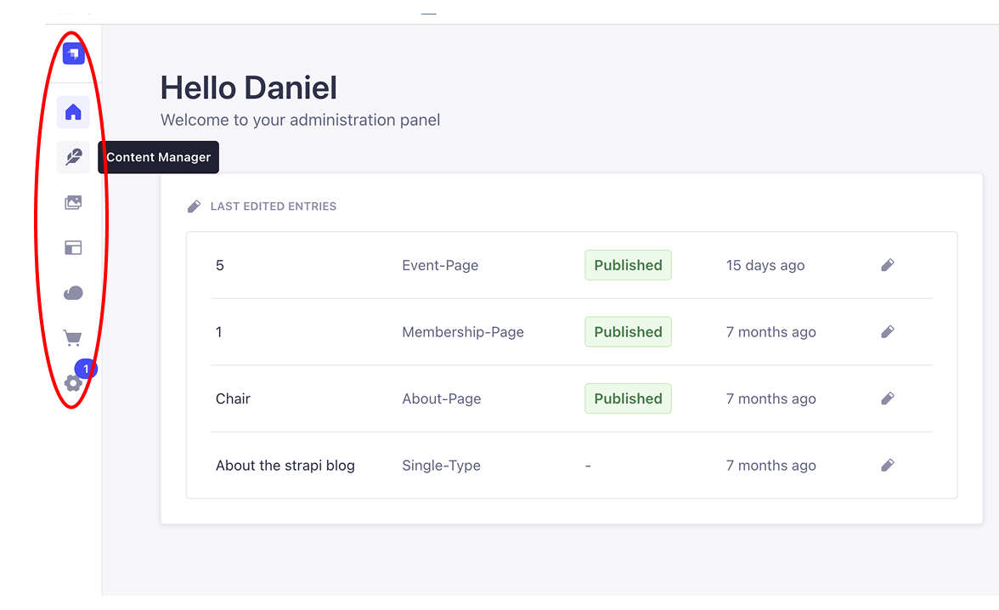

# Using Strapi for the Snohomish Tribe 
Strapi is a headless content management system (CMS) for editing web pages. 

## Getting Started 
Clone the respository if you haven't already

```bash
    git clone git@github.com:DanielekPark/strapi-cloud-template-cms.git
```

Next install npm packages

```bash 
    npm install
```

## Environment Variables
Create a .env file and create values for variables for APP_KEYS and API_TOKEN_SALT. Please refer to this [link](https://forum.strapi.io/t/error-middleware-strapi-session-app-keys-are-required/24948) if you need more clarity or if you see an error message in the terminal that starts with this Middleware "strapi::session. 
For each page using Strapi, needs a token and endpoint both should be kept a secret. 

## For the Snohomish Tribe 
### Administrator
To be added as an administrator please contact Lisa Ceniceros or Daniel Park. Login if you haven't already and go to settings (Please refer to the image below) and click users and fill out the information. 

### Creating Entries
To create an entry (hover the mouse over icons), click on the Content Manager and click the page needed (e.g. Events-Page) and click on Create new entry button. After filling out the necessary information, click to publish and it will be displayed on the Snohomish Tribe website. If an entry needs doesn't not need to be shown immediately, click on the Save button (it will not show on the Snohomish Tribe website). If a field is empty it may show a 0 on the page.

### Editing Entries
To edit content, click on the content manager and go to the page needed (e.g. Events-Page) and click on an entry. Afterwards click on publish button when finished. If the Save button is clicked it will be saved but it will not show on the Snohomish website.

### Events Page
For the following fields
-Day: provide a day of the week (e.g. Sunday)
-Month_Year: provide the month and year (e.g. May 2026)
-Date: provide a number from 1 to 31
-Time: provide the time of the event(s) (e.g. 11am)
-Link_Type: This field will need an entry of either Register or Download, capitalize the first letter of Register or Download otherwise the hyperlink will not be displayed.

### New Pages That Need Connections to Strapi
At the time of this writing, the pages that can be edited using Strapi is the Events page. If a new page needs to be connected and edited using Strapi please contact Daniel Park.


## Running the app locally
```
npm run develop
# or
yarn develop
```


## Resources and Commands for Strapi

Strapi comes with a full featured [Command Line Interface](https://docs.strapi.io/dev-docs/cli) (CLI) which lets you scaffold and manage your project in seconds.


### `start`

Start your Strapi application with autoReload disabled. [Learn more](https://docs.strapi.io/dev-docs/cli#strapi-start)

```
npm run start
# or
yarn start
```

### `build`

Build your admin panel. [Learn more](https://docs.strapi.io/dev-docs/cli#strapi-build)

```
npm run build
# or
yarn build
```

## ⚙️ Deployment

Strapi gives you many possible deployment options for your project including [Strapi Cloud](https://cloud.strapi.io). Browse the [deployment section of the documentation](https://docs.strapi.io/dev-docs/deployment) to find the best solution for your use case.

```
yarn strapi deploy
```

## 📚 Learn more

- [Resource center](https://strapi.io/resource-center) - Strapi resource center.
- [Strapi documentation](https://docs.strapi.io) - Official Strapi documentation.
- [Strapi tutorials](https://strapi.io/tutorials) - List of tutorials made by the core team and the community.
- [Strapi blog](https://strapi.io/blog) - Official Strapi blog containing articles made by the Strapi team and the community.
- [Changelog](https://strapi.io/changelog) - Find out about the Strapi product updates, new features and general improvements.

Feel free to check out the [Strapi GitHub repository](https://github.com/strapi/strapi). Your feedback and contributions are welcome!

## ✨ Community

- [Discord](https://discord.strapi.io) - Come chat with the Strapi community including the core team.
- [Forum](https://forum.strapi.io/) - Place to discuss, ask questions and find answers, show your Strapi project and get feedback or just talk with other Community members.
- [Awesome Strapi](https://github.com/strapi/awesome-strapi) - A curated list of awesome things related to Strapi.

---


